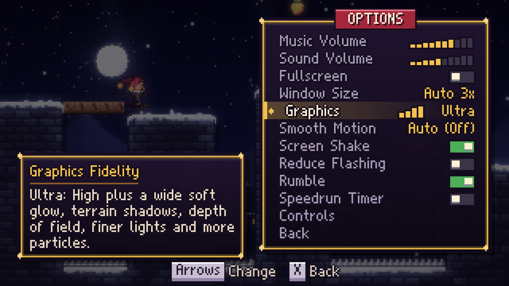
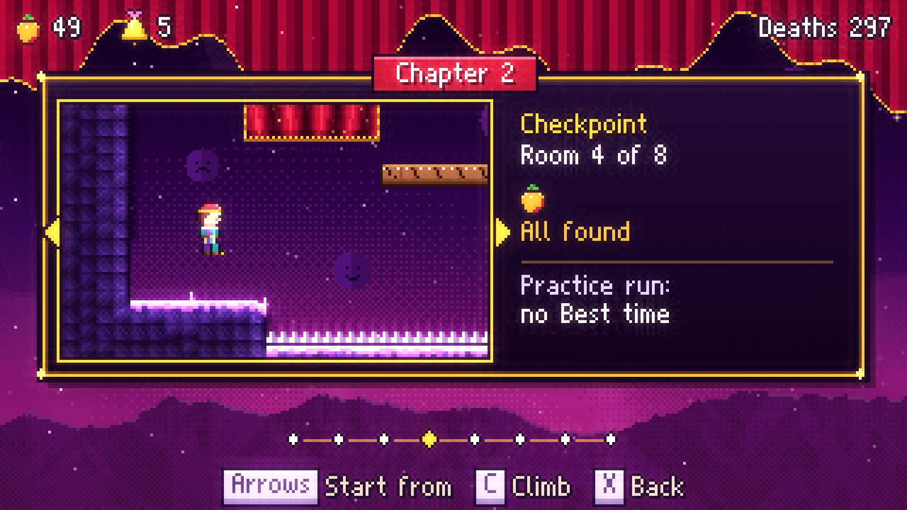
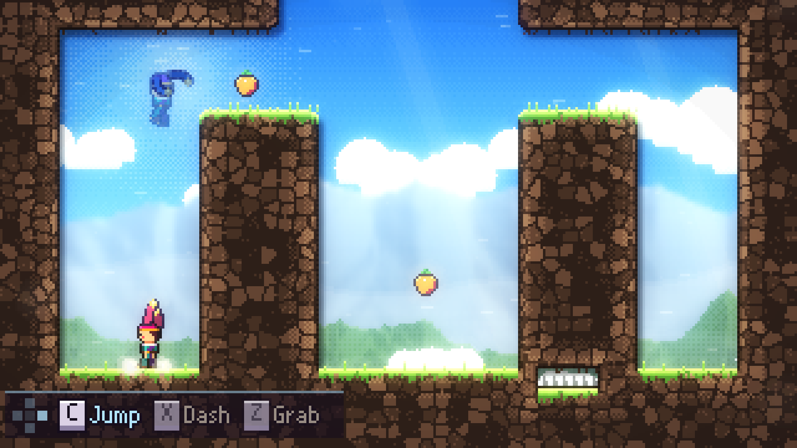

<p align="center">
  
</p>

<h1 align="center">JESTE</h1>

<p align="center">
  <b><i>A mountain that laughs back.</i></b><br>
  An original pixel-art precision platformer about a young jester climbing a mountain that shows you whatever you hide behind your smile.
</p>

<p align="center">
  
  
  
  
  
</p>

<p align="center">
  <a href="docs/media/jeste_trailer.mp4"><b>Watch the trailer</b></a> ·
  <a href="#play-it"><b>Play it</b></a> ·
  <a href="#build-from-source"><b>Build from source</b></a>
</p>

> **The download is older than this page.** The only release,
> [v0.1.0](https://github.com/nearbycoder/Jeste/releases/latest) (October 4, 2026), predates
> twelve rounds of improvements on `main`: the Graphics steps, Route Ghost, checkpoint select,
> mouse menus, Dash Aim, crash-safe saves and many fixes. To play the game as described and shown
> here, [run it from source](#build-from-source) (Godot 4.6+, no build step).

## Trailer

<p align="center">
  <a href="docs/media/jeste_trailer.mp4">
    
  </a>
  <br><sub>The 1:51 feature trailer (1080p60 MP4, 38 MB): <a href="docs/media/jeste_trailer.mp4">open it on GitHub</a> or <a href="https://github.com/nearbycoder/Jeste/raw/main/docs/media/jeste_trailer.mp4">download it</a>. Every frame is the real game at <i>Graphics: Ultra</i>, recorded from <code>main</code> with Godot's Movie Maker; the climbs are played by the project's automated solver.</sub>
</p>

## About

Mira Vale grew up as a jester in the travelling *Lark & Lantern* troupe, trained by her
grandmother **Nana Odile**, the greatest clown who ever lived. Nana always promised they
would climb **Mount Jeste** together, the mountain whose wind is said to laugh.

Nana died last winter. Mira never cried. She kept smiling and performing, until one night
on stage she froze, dropped every ball, and the crowd laughed *at* her. So she goes to climb
Jeste alone. The old bell-ringer at the foot of the mountain has a warning for her:

> *"Jeste's a trickster. They say it shows you whatever you hide behind your smile."*

Jeste is a tight, forgiving climb in the tradition of modern precision platformers. It runs
on an eight-way dash and runs through nine chapters, each built around one new idea. Deaths
cost about a second. The challenge is optional, the secrets are worth it, and assists, from
a slower game speed to a ghost that shows a proven route, are always one menu away.

## Features

### Movement that feels right


A deterministic 60 Hz simulation with coyote time, jump buffering, variable jump height,
half-gravity at the apex, wall slides, wall jumps, stamina climbing, climb-hops and
8-way dashes. Under that sit the advanced techniques: **supers, hypers, wavedashes and
wall-bounces**, plus dash corner correction and momentum lift-boosts from moving platforms.

### Nine chapters, one new idea each


| | Chapter | New mechanic |
|---|---|---|
| Prologue | **The Foot of Jeste** | Run, jump, climb, wall-jump, and finally the dash |
| 1 | **Lantern Town** | Jack-in-the-box springs, crumbling boards, dash gems |
| 2 | **The Hollow Stage** | Velvet curtains you dash through, and a chase |
| 3 | **The Grand Carnival** | Keys and gates, comedy/tragedy mask blocks that swap on every dash, cracked walls |
| 4 | **Whistling Ridge** | Gusting wind (walls shelter you) and cable gondolas |
| 5 | **Mirror Cathedral** | Circus balloons that catch and launch you, mirror panes |
| 6 | **Undertow** | Pinball bumpers, twin gems (two dashes), another chase |
| 7 | **The Summit** | Two dashes and every mechanic, remixed |
| Epilogue | **The Show** | A curtain call |

### The chase


In chase rooms, **the Grin** (Mira's own reflection) follows a fraction of a second
behind, replaying every move you made. Stop to think and it catches you.

### Collectibles and secrets

- **61 Sunberries**, including 4 **winged** ones that fly away the moment you dash.
- **7 Jester Bells**: Nana's lost bells, hidden in secret rooms behind fake and cracked walls. Each one comes with a message.
- **7 Golden Sunberries**: grab one at the start of a chapter and carry it to the end without dying.

### A story with heart


Fully scripted cutscenes with animated, blinking, talking portraits and per-character
voice blips. You meet Old Bellamy the bell-ringer, Tobi the anxious painter, Ringmaster
Oddo (a ghost who never ends his show), and the Grin.

### Four graphics steps



The world is painted pixel by pixel from the collision map, with parallax backdrops, light
pools, a glow pass and per-chapter colour grading. **Options → Graphics** (Graphics Fidelity)
picks how much of that is drawn, and the change shows at once:

| Step | What it draws |
|---|---|
| **Low** | No full-screen glow or colour grading, no fog or light shafts, fewer particles and no dash ribbon. For weak GPUs. |
| **Medium** | The grade with a lighter glow and fog, no light shafts, fewer particles than High. |
| **High** (default) | The full look: glow, colour grading, fog, light shafts in five chapters and every particle. |
| **Ultra** | High plus a wide soft glow, soft shadows cast by the terrain, light shafts in every chapter, depth of field on distant ridges, finer light pools, more particles, a few soft motes drifting in front, denser dash afterimages and a longer ribbon. |

On the one machine it was measured on (an AMD Radeon 8060S iGPU), every step takes well under
a millisecond of GPU time per frame; the numbers are in
[docs/IMPROVEMENTS.md](docs/IMPROVEMENTS.md#graphics-steps-and-frame-times).

### Juice and polish

Squash and stretch, dash afterimages and ribbon trails, freeze frames, directional screen
shake, a look-ahead camera, gamepad rumble, and a jester cap with two physics-simulated
tails and jingle bells. Pausing softly blurs the climb behind the menu (from *Medium* up),
toggles slide, changed values flash, and every press in a menu answers with a sound,
backing out included.

### Front end



A title screen with a campfire and a juggling Mira. Chapter select shows living postcards
rendered from each chapter's real rooms, and once you've reached more than one room of a
chapter you can **start from any checkpoint** you've reached: the postcard shows the room and
which of its berries and bell you still lack. Results screens show berries, deaths, time,
bells, golden runs and whether the climb set a new Best. *Continue* returns you to the last
room you entered.

## Controls

| Action | Keyboard (rebindable) | Gamepad (rebindable) |
|---|---|---|
| Move / aim | Arrow keys or WASD | D-pad or left stick |
| Jump | C, Space or J | A or Y |
| Dash (8 directions) | X, K or Shift | X or B |
| Grab / climb | Z, V or L | Shoulders or triggers |
| Pause | Esc, Enter or P | Start |
| Fullscreen | F11 or Alt+Enter | |

- **Menus:** Jump's keys or buttons select and Dash's go back (the hint line names them); a pad's
  A and B also select and go back unless you've bound them to the other action. Holding a
  direction repeats.
- **Mouse:** works in every menu. Point to select, left-click to choose, right-click to go back,
  and the wheel steps values, chapters and checkpoints, or scrolls the credits. A click also
  reads the next line of a cutscene. Gameplay itself is keyboard or gamepad only.
- **Touch** isn't supported.
- **Prompts** follow the device you used last, name keys as your keyboard layout prints them
  (keys are bound by position, so on AZERTY the default Grab key reads W) and name pad buttons the
  way your controller does (A / Cross / B for jump on Xbox, PlayStation and Nintendo pads).
- **Unplugging a controller** or switching to another window pauses the game. The mouse cursor
  hides while you play.

## How to play

- **Hold jump** to jump higher. **Jump off a wall** to kick away from it.
- **Hold grab** against a wall to cling and climb. Climbing drains stamina, which refills on the ground.
- **Dash** once in the air in any of eight directions. Mira's cap shows when the dash is ready
  (red), spent (blue) or doubled (pink). Landing recharges it.
- **Hold Pause** during a cutscene to skip the rest of it; tapping jump or dash advances line by line.
- **Pause → Restart Chapter** (after a confirm) starts a fresh run from the chapter's first room,
  for golden-berry attempts and speedruns. Only runs from a chapter's start can set a Best time.

## Settings and accessibility



Every Options and Assist row says what it does in a box beside the panel. In the pause menu the
panels open on the side of the screen away from Mira, so she stays in view.

**Options** (title screen and pause menu): music and sound volume, fullscreen, window size
(*Auto* is about three quarters of the screen; the 320×180 canvas is always integer-scaled),
**Graphics** (above), **Smooth Motion** (draws movement between the game's 60 Hz steps; *Auto*
turns it on for displays that aren't a multiple of 60 Hz or below 100% game speed, since it adds
up to 17 ms of display delay), screen shake, **Reduce Flashing** (dims full-screen flashes and
the dash shimmer to a fifth), rumble, a speedrun timer and **Controls**.

**Controls:** rebind every key, and Jump, Dash and Grab's pad buttons (conflicts swap).
**Grab Mode: Toggle** makes one press of grab hold until the next. **Stick Deadzone** (10–70%,
default 40%) comes with a live dial of where your stick is, so a drifting stick can be tuned
out. The stick aims in eight equal 45° directions however far you push it past the deadzone.

**Pause → Assist** (your progress counts the same):
- **Game Speed** 50–100%, which slows the whole game, controls included.
- **Infinite Stamina** and **Invincibility**. Invincible, a fall into a pit bounces Mira back up,
  and a curtain dash into a wall or a crushing gondola can't kill her.
- **Air Dashes:** *Two* wherever a room gives one, or *Infinite*.
- **Dash Aim:** pressing Dash stops time and shows an arrow; hold a direction and let go to dash.
- **Route Ghost:** a translucent Mira runs the room the way the solver proved it can be done,
  using only the moves the game teaches. She loops, restarts when you respawn, changes nothing,
  and a strip at the bottom left lights the buttons she presses, named by your bindings. Set her to
  **Berries** to see how to take every berry and bell you're still missing, then the way into a
  secret room. After 10 deaths in a room the game points you to her, once.

Saves and settings are written to a temporary file and renamed, with a `.bak` of the previous
copy. If a file is ever damaged, the game loads the backup, keeps the damaged one as `.corrupt`
and tells you on the title screen.

## Content overview

- **9 chapters** (prologue, seven chapters and an epilogue) with **69 rooms**, 7 of them secret.
- **13 music tracks** built on one recurring theme, plus 7 ambience beds and 36 layered sound effects.
- **6 other speaking characters** besides Mira, each with a portrait and a voice of their own.
- A full clear (every berry, every bell) is short for an expert. The automated route takes under four minutes. Golden runs and blind first climbs take much longer.

## Screenshots

All captured from `main` at *Graphics: Ultra*.

<table>
  <tr>
    <td></td>
    <td></td>
  </tr>
  <tr>
    <td></td>
    <td></td>
  </tr>
  <tr>
    <td></td>
    <td></td>
  </tr>
</table>

## Play it

**System requirements:** 64-bit Linux (x86_64) and a Vulkan-capable GPU. Developed and tested on
CachyOS with an AMD Radeon 8060S iGPU under Wayland and Xwayland. A keyboard or gamepad to play.

**From source (the current game):** install [Godot 4.6+](https://godotengine.org/download)
(built and tested with 4.7.2), then

```sh
git clone https://github.com/nearbycoder/Jeste.git && cd Jeste
godot --path .                      # or open the folder in the Godot editor and press F5
```

**The v0.1.0 release (October 4):** download **`Jeste-v0.1.0-linux-x86_64.zip`** from the
[latest release](https://github.com/nearbycoder/Jeste/releases/latest), unzip it and run
`./Jeste.x86_64`. It has none of the features and fixes added since (see the note at the top).

Saves and settings live in `~/.local/share/godot/app_userdata/Jeste/`.

Windows, macOS and web builds aren't published. `export_presets.cfg` has presets for all three
(Windows x86_64, a single-threaded web build, and an ad-hoc-signed, un-notarized universal macOS
app with bundle id `com.nearbycoder.jeste`), but none of them has been exported or run: this
machine has only the Linux export template. Treat them as untested starting points.

## Build from source

**Requirements:** [Godot 4.6+](https://godotengine.org/download) (built and tested with
**4.7.2**) and Python 3. `ffmpeg` is only needed to regenerate audio or the trailer, and
NumPy only to regenerate audio.

**Run the verification suite.** It needs no display and takes a few minutes with cached
solutions (both route sets):

```sh
python3 tests/run_tests.py                      # all chapters: lint, solve, prove, play end-to-end, menu flow, menu fuzz
python3 tests/run_tests.py --chapters 1 3 --resolve   # re-solve chosen chapters from scratch
```

Results are written to `tests/REPORT.md`. Every Godot run in the suite gets its own throwaway
`user://` in `build/test_user/`, so tests never read or write your real save or settings.

A longer run of random input through the menus and the level (seed and frame count; it
refuses to run unless Godot's user data is under `build/`):

```sh
XDG_DATA_HOME=$PWD/build/fuzz/data XDG_CONFIG_HOME=$PWD/build/fuzz/config \
  godot --headless --path . --fixed-fps 60 res://tests/menu_fuzz.tscn -- 7 60000
```

**Regenerate the assets.** All 56 PNGs and all audio are produced by code. Re-running the art
generator reproduces the committed images byte for byte.

```sh
godot --headless --path . --script res://tools/gen_art.gd    # sprites, tiles, backgrounds, font
python3 -m venv .venv && .venv/bin/pip install numpy
.venv/bin/python tools/gen_audio.py                          # all music, ambience and sfx (needs ffmpeg)
.venv/bin/python tools/gen_audio.py ch3 sfx                  # or just some of them
```

**Export a build.** Install the 4.7.2 export templates first (*Editor → Manage Export Templates*):

```sh
mkdir -p build/linux
godot --headless --path . --export-release "Linux" build/linux/Jeste.x86_64
# untested presets: "Windows Desktop" (build/windows/Jeste.exe), "Web" (build/web/index.html),
# "macOS" (build/macos/Jeste.zip, not notarized, so Gatekeeper will warn)
```

**Rebuild the trailer, teaser, poster and screenshots.** This needs a display, because Godot's
Movie Maker renders the footage (offline, at *Graphics: Ultra*, so every frame is kept). Set
`GODOT` to run Godot another way, for example on a private nested compositor:

```sh
python3 tools/trailer/make_trailer.py               # all stages; work files go to build/trailer/
python3 tools/trailer/make_trailer.py trailer qc    # re-cut without re-recording
```

**Debug renderers.** These need a display:

```sh
godot --path . --rendering-method mobile res://tools/overview.tscn -- 3 build/ch3.png   # every room of a chapter
godot --path . --rendering-method mobile res://tools/strip.tscn -- 3 3-03 tests/solutions/3_3-03_s0_collect.json build/s.png
godot --path . --rendering-method mobile res://tools/demo.tscn                          # self-playing demo reel
# the same frame at a Graphics step (0 Low .. 3 Ultra), or its frame times with "bench"
godot --path . --fixed-fps 60 res://tools/fidelity_shot.tscn -- 1 1-03 tests/solutions/1_1-03_s0_to_1-04.json 100 3 build/ultra.png
godot --path . --disable-vsync res://tools/fidelity_shot.tscn -- 1 1-03 tests/solutions/1_1-03_s0_to_1-04.json 1800 3 bench
```

**Smooth Motion probe.** Replays a room's Route Ghost route at a forced frame rate and logs
where Mira is drawn each frame (no display needed):

```sh
godot --headless --path . --fixed-fps 144 res://tools/motion_probe.tscn -- 1 1-01 1.0 on build/motion.csv   # chapter room speed on|off out.csv
```

## Project structure

```
scenes/            main (title), chapter select, level, credits
scripts/sim/       deterministic simulation (no nodes): World, RoomDef, LevelDB, Solver
scripts/game/      level controller, renderers, terrain painter, effects, lighting, post-fx,
                   HUD, dialogue, audio, save / settings / input
scripts/ui/        title, chapter select, credits, UI kit, bitmap font renderer
data/levels/       one ASCII level file per chapter (legend below)
data/story/        cutscene scripts
assets/            generated art (PNG) and audio (Ogg / WAV), see tools/
tools/             art + audio generators, debug renderers, demo reel, Graphics frame captures
tools/trailer/     trailer pipeline: shot recorder, cards, caption plates, ffmpeg assembly
tests/             verification suite, cached solver solutions (fastest and basic-moveset), proven routes
docs/media/        trailer, teaser, poster and screenshots used by this README
docs/IMPROVEMENTS.md   plans and results of every improvement round since release
```

<details>
<summary>Level file legend</summary>

```
#  solid ground        %  alternate solid    ,  background wall   &  fake wall (secret)
=  jump-through        ~  crumbling boards   ^ v < >  spikes
P  spawn point         S [ ]  springs (up / right / left)
*  dash gem            +  twin gem           b  sunberry          w  winged sunberry
H  jester bell         G  golden sunberry    k  key               D  locked gate
C  curtain / mirror    X  cracked wall       R B  comedy / tragedy mask blocks
Z  gondola             z  gondola target     O  balloon           o  bumper
E  chapter end         N  NPC                1-9 cutscene trigger zones
f l c t s x j a u m q r   decorations
```

Room headers set `exits` (e.g. `right:1-02 top[3-8]:1-03b`), `wind`, `dashes`, `chase`,
`npc`, `triggers`, `enter`, `title` and more.
</details>

## Tech highlights

- **One simulation, three users.** `scripts/sim/world.gd` is a node-free, fixed-step
  simulation of a room. The game renders it, the solver searches it and the tests replay it,
  so an input recording that clears a room in a test clears it in the game.
- **Every room is proven beatable.** `scripts/sim/solver.gd` runs a weighted A\* search over
  input macro-actions (run, jump, hold, 8-way dash, climb…). It simulates every candidate
  with the real physics, using a gravity-aware heuristic and TSP-ordered collectibles,
  across parallel headless Godot workers. The suite then proves that every chapter's end is
  reachable and that every collectible can be taken on a route that still finishes. It
  plays each chapter end-to-end through the real `Level` scene with zero deaths, which also
  proves every golden run. It repeats the proofs with the basic moveset only, since the
  solver's fastest routes lean on supers and hypers the game never teaches, and scores each
  room's route for how often a 1-frame timing slip is fatal (`tools/slip_deaths.gd` shows where).
  The basic-moveset routes are what the Route Ghost plays.
- **Procedural art.** Characters are rigged "paper dolls": hand-drawn ASCII heads and
  torsos with procedurally posed limbs, 34 animation frames each. Terrain is painted per
  pixel from the collision map on worker threads, with bevel, ambient occlusion, material
  detail and snow, grass or crystal caps. Backdrops are layered noise landscapes with set
  pieces.
- **Synthesized audio.** `tools/synth.py` is a small NumPy synthesizer: e-piano, FM bells,
  pads, choir, organ, calliope, drums and a convolution reverb. `tools/gen_audio.py`
  composes 13 tracks on one theme as seamless 32-bar loops, loudness-normalised.
- **Reproducible trailer.** `tools/trailer/` drives the real game through Movie Maker with
  the proven routes and scripted menu presses, renders captions in the game's pixel font, and
  assembles everything with ffmpeg: transitions on the music grid, a ducked music bed and
  EBU R128 loudness.

## Credits and tooling

- **Game, code, art, music and writing:** [nearbycoder](https://github.com/nearbycoder),
  built with [Claude Code](https://claude.com/claude-code) as an AI pair programmer.
- **Engine:** [Godot Engine](https://godotengine.org) 4.7 (MIT).
- **Tools:** Python, NumPy and FFmpeg for audio synthesis and trailer assembly.
- **Movement tuning:** the controller constants follow a player controller published under
  the MIT license. See [THIRD_PARTY_NOTICES.md](THIRD_PARTY_NOTICES.md).
- **No third-party art, fonts, music or samples.** Every pixel and every sound is generated
  by code in this repository.

## Status and known issues

Jeste is a complete, playable game, from the prologue through the epilogue and credits.
`main` has had twelve rounds of fixes and features since the v0.1.0 release; each round's plan,
results and limits are in [docs/IMPROVEMENTS.md](docs/IMPROVEMENTS.md).

- **The v0.1.0 release is out of date.** It lacks every change since October 4, including
  fixes for Game Speed not slowing gameplay, saves that a crash could lose, a Dash that could
  stick after rebinding, prompts naming the wrong keys on non-US keyboards, Invincibility
  that missed some deaths, and closing the pause menu making Mira jump. Play from source for now.
- **Linux only.** Other platforms should export cleanly but haven't been built or tested.
- **Tested on one machine.** The Graphics steps were measured only on an AMD Radeon 8060S iGPU
  (Vulkan); *Low* hasn't been tried on a weak GPU, and *Ultra*'s wide glow may draw differently on
  the web build's renderer. The window and fullscreen behaviour was checked on one 4K monitor
  under Wayland and in private KWin sessions; Smooth Motion hasn't been watched on a real 144 or
  165 Hz display.
- **Simulated input only.** Gamepads (including the stick deadzone, Dash Aim and rumble) and
  the mouse were exercised with simulated events, not on a range of physical controllers, mice or
  touchpads. Controller families are recognised by the name the pad reports, so an unusual pad
  may show Xbox button names. Keyboard layouts were checked for French and German on Linux only.
- **Difficulty was tuned against a bot.** Every room is proven possible with the basic moveset
  alone, and the three rooms where small timing slips were most often fatal were eased. Human
  playtesting is still light, so some rooms may feel tighter than intended; Assist mode and the
  Route Ghost are there for that.
- **No license has been chosen yet.** Until a `LICENSE` file is added, all rights are
  reserved by the author.
