<p align="center">
  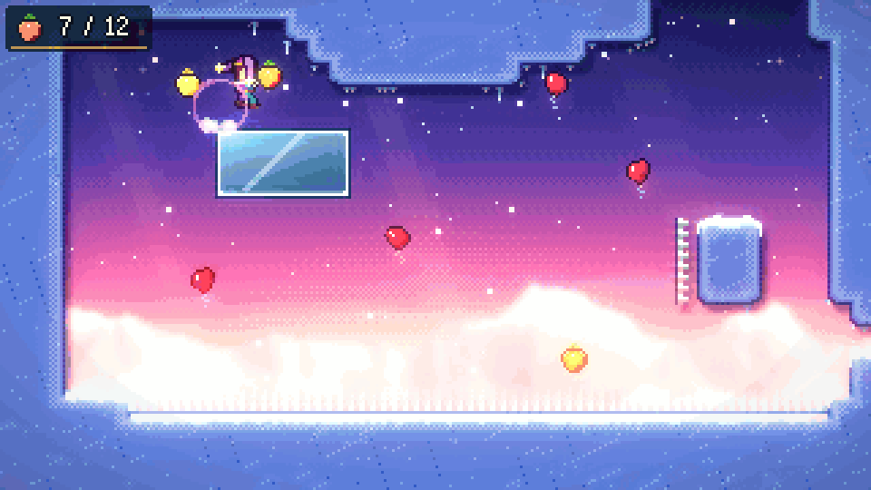
</p>

<h1 align="center">JESTE</h1>

<p align="center">
  <b><i>A mountain that laughs back.</i></b><br>
  An original pixel-art precision platformer about a young jester climbing a mountain that shows you whatever you hide behind your smile.
</p>

<p align="center">
  
  
  
  
  
</p>

<p align="center">
  <a href="https://github.com/nearbycoder/Jeste/releases/latest"><b>Download for Linux</b></a> ·
  <a href="docs/media/jeste_trailer.mp4"><b>Watch the trailer</b></a> ·
  <a href="#build-from-source"><b>Build from source</b></a>
</p>

## Trailer

<p align="center">
  <a href="docs/media/jeste_trailer.mp4">
    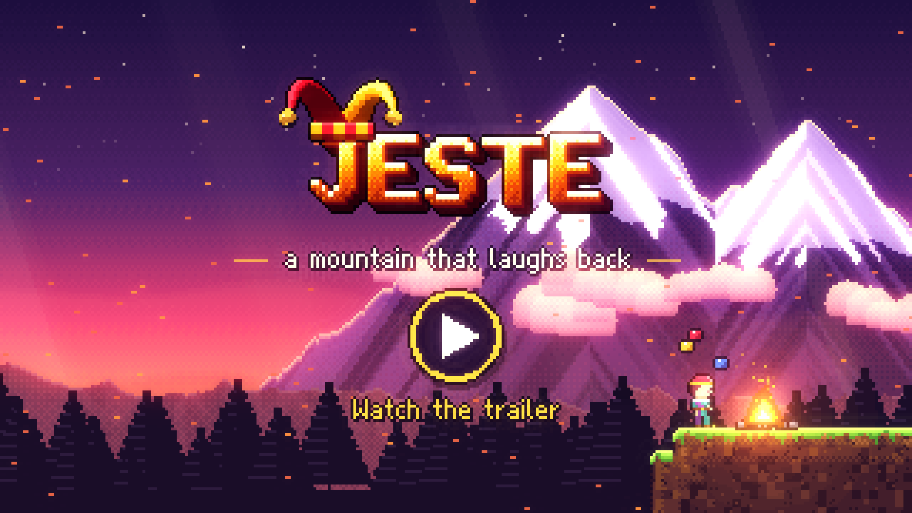
  </a>
  <br><sub>The 1:48 feature trailer (1080p60 MP4, 38 MB): <a href="docs/media/jeste_trailer.mp4">open it on GitHub</a> or <a href="https://github.com/nearbycoder/Jeste/raw/main/docs/media/jeste_trailer.mp4">download it</a>. Every frame is the real game, played by the project's automated solver.</sub>
</p>

## About

Mira Vale grew up as a jester in the travelling *Lark & Lantern* troupe, trained by her
grandmother **Nana Odile**, the greatest clown who ever lived. Nana always promised they
would climb **Mount Jeste** together, the mountain whose wind is said to laugh.

Nana died last winter. Mira never cried. She kept smiling and performing, until one night
on stage she froze, dropped every ball, and the crowd laughed *at* her. So she goes to climb
Jeste alone. The old bell-ringer at the foot of the mountain has a warning for her:

> *"Jeste's a trickster. They say it shows you whatever you hide behind your smile."*

Jeste is a tight, forgiving climb in the tradition of modern precision platformers. It runs
on an eight-way dash and runs through nine chapters, each built around one new idea. Deaths
cost about a second. The challenge is optional, the secrets are worth it, and an assist mode
is always one menu away.

## How to play

| Action | Keyboard (rebindable) | Gamepad |
|---|---|---|
| Move / aim | Arrow keys or WASD | D-pad or left stick |
| Jump | C, Space or J | A |
| Dash (8 directions) | X, K or Shift | X or B |
| Grab / climb | Z, V or L | Shoulders or triggers |
| Pause | Esc, Enter or P | Start |

- **Hold jump** to jump higher. **Jump off a wall** to kick away from it.
- **Hold grab** against a wall to cling and climb. Climbing drains stamina, which refills on the ground.
- **Dash** once in the air in any of eight directions. Mira's cap shows when the dash is ready (red), spent (blue) or doubled (pink). Landing recharges it.
- **Options → Controls** rebinds every key, swapping on conflicts. On-screen prompts follow whichever device you used last, and name pad buttons the way your controller does (A / Cross / B for jump on Xbox, PlayStation and Nintendo pads).
- **Options → Reduce Flashing** dims full-screen flashes (bells, deaths, cutscenes, mask swaps) and the dash shimmer to a fifth of their strength. **Screen Shake** can be turned off separately.
- **Pause → Assist** offers slower game speed (50–100%), infinite stamina and invincibility. Your progress counts the same.

## Features

### Movement that feels right

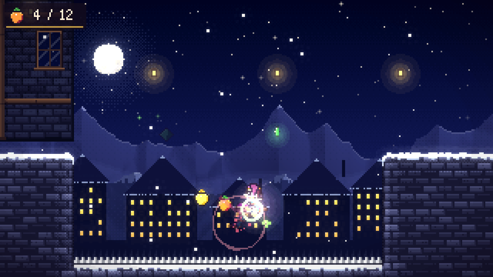

A deterministic 60 Hz simulation with coyote time, jump buffering, variable jump height,
half-gravity at the apex, wall slides, wall jumps, stamina climbing, climb-hops and
8-way dashes. Under that sit the advanced techniques: **supers, hypers, wavedashes and
wall-bounces**, plus dash corner correction and momentum lift-boosts from moving platforms.

### Nine chapters, one new idea each

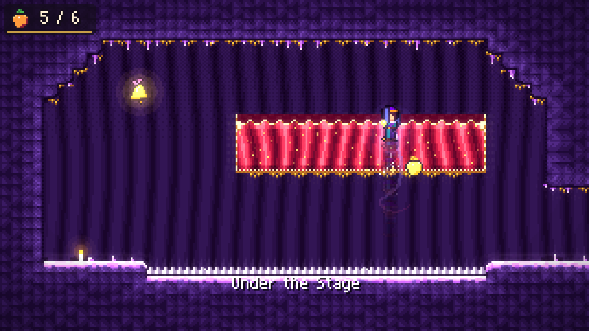

| | Chapter | New mechanic |
|---|---|---|
| Prologue | **The Foot of Jeste** | Run, jump, climb, wall-jump, and finally the dash |
| 1 | **Lantern Town** | Jack-in-the-box springs, crumbling boards, dash gems |
| 2 | **The Hollow Stage** | Velvet curtains you dash through, and a chase |
| 3 | **The Grand Carnival** | Keys and gates, comedy/tragedy mask blocks that swap on every dash, cracked walls |
| 4 | **Whistling Ridge** | Gusting wind (walls shelter you) and cable gondolas |
| 5 | **Mirror Cathedral** | Circus balloons that catch and launch you, mirror panes |
| 6 | **Undertow** | Pinball bumpers, twin gems (two dashes), another chase |
| 7 | **The Summit** | Two dashes and every mechanic, remixed |
| Epilogue | **The Show** | A curtain call |

### The chase

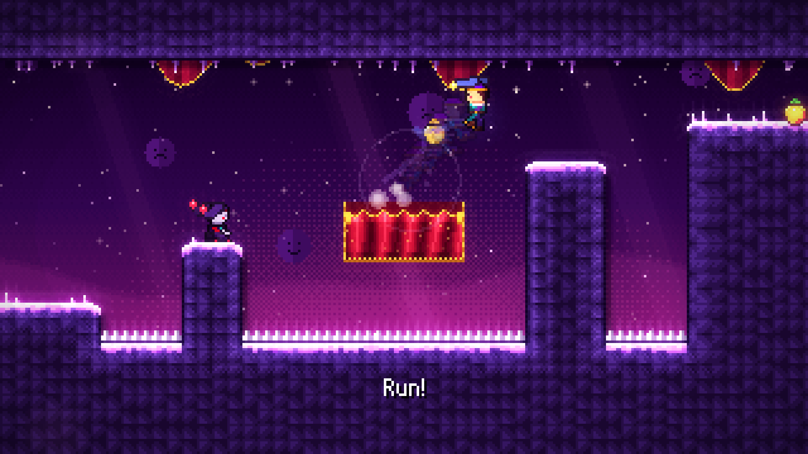

In chase rooms, **the Grin** (Mira's own reflection) follows a fraction of a second
behind, replaying every move you made. Stop to think and it catches you.

### Collectibles and secrets

- **61 Sunberries**, including 4 **winged** ones that fly away the moment you dash.
- **7 Jester Bells**: Nana's lost bells, hidden in secret rooms behind fake and cracked walls. Each one comes with a message.
- **7 Golden Sunberries**: grab one at the start of a chapter and carry it to the end without dying.

### A story with heart

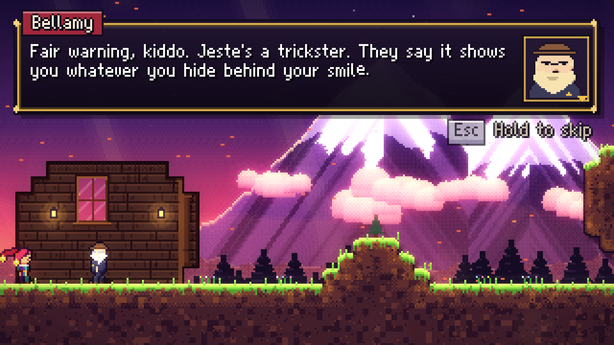

Fully scripted cutscenes with animated, blinking, talking portraits and per-character
voice blips. You meet Old Bellamy the bell-ringer, Tobi the anxious painter, Ringmaster
Oddo (a ghost who never ends his show), and the Grin.

### Juice everywhere

Squash and stretch, dash afterimages and ribbon trails, freeze frames, directional screen
shake, a look-ahead camera, gamepad rumble, and a jester cap with two physics-simulated
tails and jingle bells. The world is painted pixel by pixel from the collision map, with
parallax backdrops, a glow pass, bloom and per-chapter colour grading.

### Front end

A title screen with a campfire and a juggling Mira. Chapter select shows living
postcards rendered from each chapter's real opening room. Results screens show berries,
deaths, time, bells and golden runs. Options cover volume, fullscreen, window size, screen shake,
reduced flashing, rumble, an optional speedrun timer and key rebinding. The game auto-pauses when the window loses focus,
and *Continue* returns you to the last room you entered.

## Content overview

- **9 chapters** (prologue, seven chapters and an epilogue) with **69 rooms**, 7 of them secret.
- **13 music tracks** built on one recurring theme, plus 7 ambience beds and 36 layered sound effects.
- **6 other speaking characters** besides Mira, each with a portrait and a voice of their own.
- A full clear (every berry, every bell) is short for an expert. The automated route takes under four minutes. Golden runs and blind first climbs take much longer.

## Screenshots

<table>
  <tr>
    <td>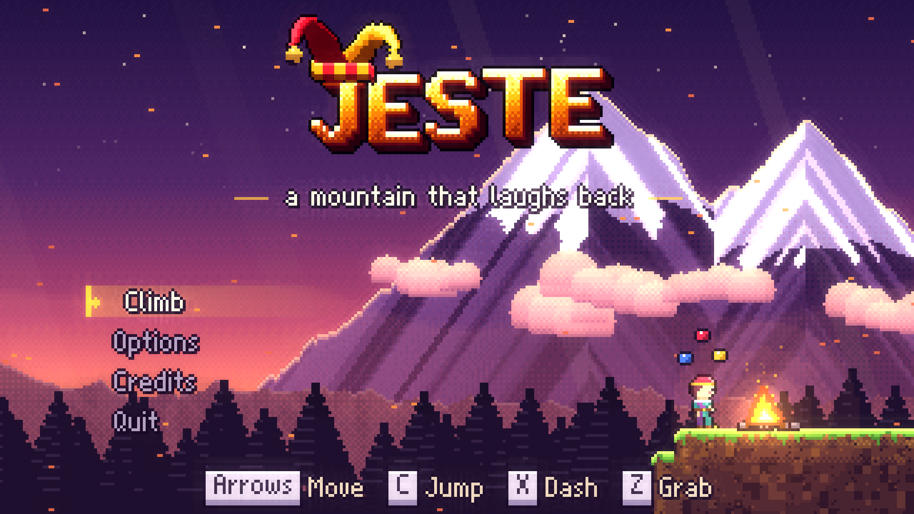</td>
    <td>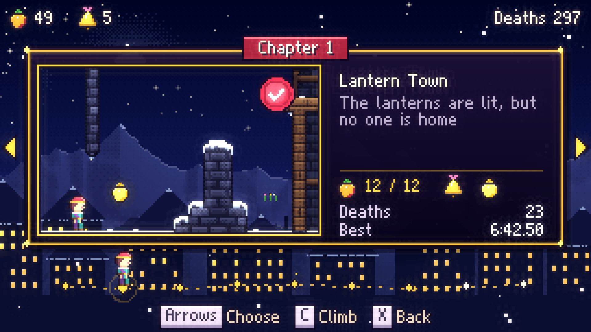</td>
  </tr>
  <tr>
    <td>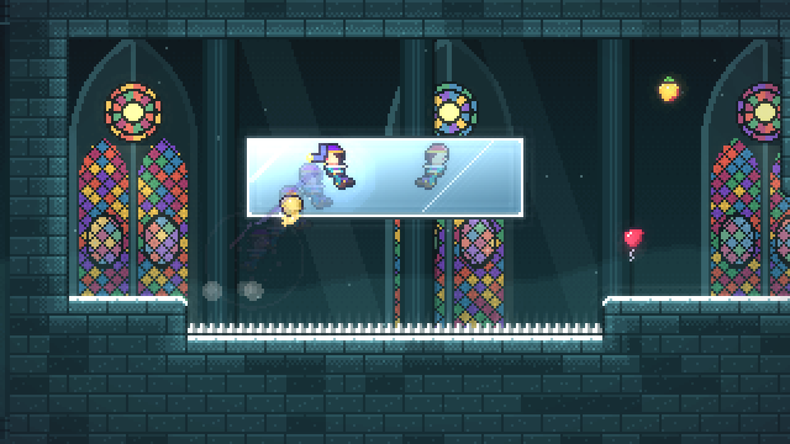</td>
    <td>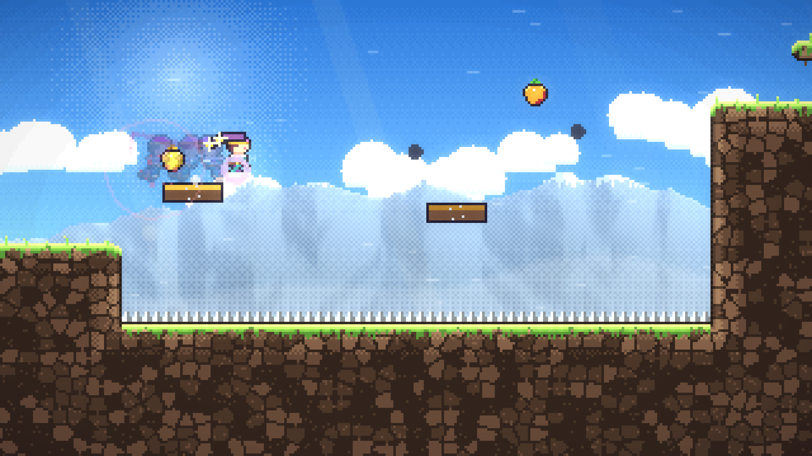</td>
  </tr>
  <tr>
    <td>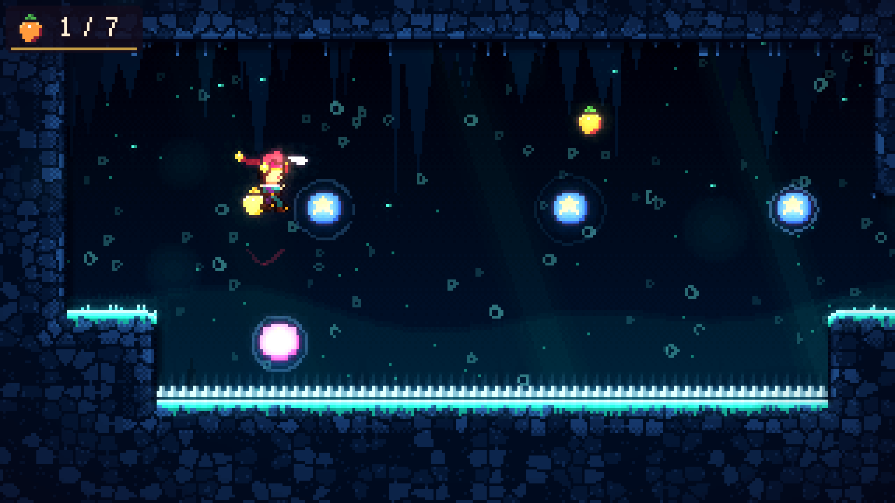</td>
    <td>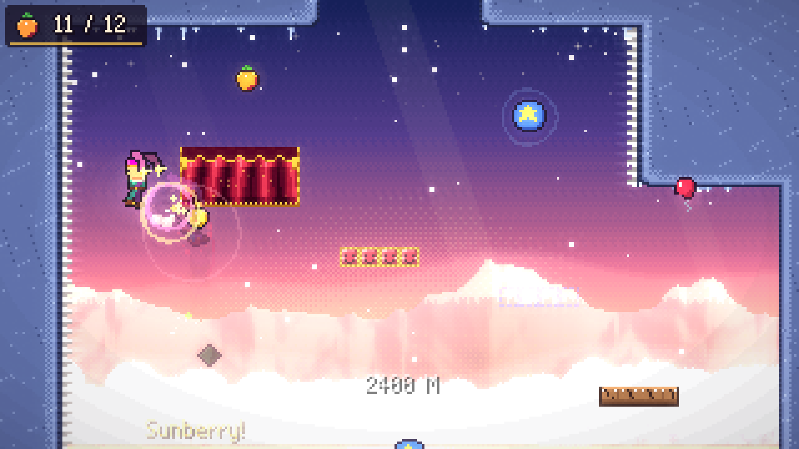</td>
  </tr>
</table>

## Play it

Download **`Jeste-v0.1.0-linux-x86_64.zip`** from the
[latest release](https://github.com/nearbycoder/Jeste/releases/latest), unzip it and run
`./Jeste.x86_64`. It's a single 64-bit binary and needs a Vulkan-capable GPU. Saves and
settings are stored in `~/.local/share/godot/app_userdata/Jeste/`.

Windows, macOS and web builds aren't published yet. `export_presets.cfg` has presets for all
three (Windows x86_64, a single-threaded web build, and an ad-hoc-signed, un-notarized
universal macOS app with bundle id `com.nearbycoder.jeste`), but none of them has been
exported or run yet: this machine has only the Linux export template. Treat them as untested
starting points.

## Build from source

**Requirements:** [Godot 4.6+](https://godotengine.org/download) (built and tested with
**4.7.2**) and Python 3. `ffmpeg` is only needed to regenerate audio or the trailer, and
NumPy only to regenerate audio.

```sh
git clone https://github.com/nearbycoder/Jeste.git && cd Jeste
godot --path .                      # play (or open the folder in the Godot editor and press F5)
```

**Run the verification suite.** It needs no display and takes about 30 seconds with cached solutions:

```sh
python3 tests/run_tests.py                      # all chapters: lint, solve, prove, play end-to-end, menu flow
python3 tests/run_tests.py --chapters 1 3 --resolve   # re-solve chosen chapters from scratch
```

Results are written to `tests/REPORT.md`.

**Regenerate the assets.** All 56 PNGs and all audio are produced by code. Re-running the art
generator reproduces the committed images byte for byte.

```sh
godot --headless --path . --script res://tools/gen_art.gd    # sprites, tiles, backgrounds, font
python3 -m venv .venv && .venv/bin/pip install numpy
.venv/bin/python tools/gen_audio.py                          # all music, ambience and sfx (needs ffmpeg)
.venv/bin/python tools/gen_audio.py ch3 sfx                  # or just some of them
```

**Export a build.** Install the 4.7.2 export templates first (*Editor → Manage Export Templates*):

```sh
mkdir -p build/linux
godot --headless --path . --export-release "Linux" build/linux/Jeste.x86_64
# untested presets: "Windows Desktop" (build/windows/Jeste.exe), "Web" (build/web/index.html),
# "macOS" (build/macos/Jeste.zip, not notarized, so Gatekeeper will warn)
```

**Rebuild the trailer, teaser, poster and screenshots.** This needs a display, because Godot's Movie Maker renders the footage:

```sh
python3 tools/trailer/make_trailer.py               # all stages; work files go to build/trailer/
python3 tools/trailer/make_trailer.py trailer qc    # re-cut without re-recording
```

**Debug renderers.** These need a display:

```sh
godot --path . --rendering-method mobile res://tools/overview.tscn -- 3 /tmp/ch3.png   # every room of a chapter
godot --path . --rendering-method mobile res://tools/strip.tscn -- 3 3-03 tests/solutions/3_3-03_s0_collect.json /tmp/s.png
godot --path . --rendering-method mobile res://tools/demo.tscn                         # self-playing demo reel
```

## Project structure

```
scenes/            main (title), chapter select, level, credits
scripts/sim/       deterministic simulation (no nodes): World, RoomDef, LevelDB, Solver
scripts/game/      level controller, renderers, terrain painter, effects, lighting, post-fx,
                   HUD, dialogue, audio, save / settings / input
scripts/ui/        title, chapter select, credits, UI kit, bitmap font renderer
data/levels/       one ASCII level file per chapter (legend below)
data/story/        cutscene scripts
assets/            generated art (PNG) and audio (Ogg / WAV), see tools/
tools/             art + audio generators, debug renderers, demo reel
tools/trailer/     trailer pipeline: shot recorder, cards, caption plates, ffmpeg assembly
tests/             verification suite, cached solver solutions (fastest and basic-moveset), proven routes
docs/media/        trailer, teaser, poster and screenshots used by this README
```

<details>
<summary>Level file legend</summary>

```
#  solid ground        %  alternate solid    ,  background wall   &  fake wall (secret)
=  jump-through        ~  crumbling boards   ^ v < >  spikes
P  spawn point         S [ ]  springs (up / right / left)
*  dash gem            +  twin gem           b  sunberry          w  winged sunberry
H  jester bell         G  golden sunberry    k  key               D  locked gate
C  curtain / mirror    X  cracked wall       R B  comedy / tragedy mask blocks
Z  gondola             z  gondola target     O  balloon           o  bumper
E  chapter end         N  NPC                1-9 cutscene trigger zones
f l c t s x j a u m q r   decorations
```

Room headers set `exits` (e.g. `right:1-02 top[3-8]:1-03b`), `wind`, `dashes`, `chase`,
`npc`, `triggers`, `enter`, `title` and more.
</details>

## Tech highlights

- **One simulation, three users.** `scripts/sim/world.gd` is a node-free, fixed-step
  simulation of a room. The game renders it, the solver searches it and the tests replay it,
  so an input recording that clears a room in a test clears it in the game.
- **Every room is proven beatable.** `scripts/sim/solver.gd` runs a weighted A\* search over
  input macro-actions (run, jump, hold, 8-way dash, climb…). It simulates every candidate
  with the real physics, using a gravity-aware heuristic and TSP-ordered collectibles,
  across parallel headless Godot workers. The suite then proves that every chapter's end is
  reachable and that every collectible can be taken on a route that still finishes. It
  plays each chapter end-to-end through the real `Level` scene with zero deaths, which also
  proves every golden run. It repeats the proofs with the basic moveset only, since the
  solver's fastest routes lean on supers and hypers the game never teaches, and scores each
  room's route for how often a 1-frame timing slip is fatal (`tools/slip_deaths.gd` shows where).
- **Procedural art.** Characters are rigged "paper dolls": hand-drawn ASCII heads and
  torsos with procedurally posed limbs, 34 animation frames each. Terrain is painted per
  pixel from the collision map on worker threads, with bevel, ambient occlusion, material
  detail and snow, grass or crystal caps. Backdrops are layered noise landscapes with set
  pieces.
- **Synthesized audio.** `tools/synth.py` is a small NumPy synthesizer: e-piano, FM bells,
  pads, choir, organ, calliope, drums and a convolution reverb. `tools/gen_audio.py`
  composes 13 tracks on one theme as seamless 32-bar loops, loudness-normalised.
- **Reproducible trailer.** `tools/trailer/` drives the real game through Movie Maker with
  the proven routes, renders captions in the game's pixel font, and assembles everything
  with ffmpeg. That covers transitions on the music grid, a ducked music bed and EBU R128
  loudness.

## Credits and tooling

- **Game, code, art, music and writing:** [nearbycoder](https://github.com/nearbycoder),
  built with [Claude Code](https://claude.com/claude-code) as an AI pair programmer.
- **Engine:** [Godot Engine](https://godotengine.org) 4.7 (MIT).
- **Tools:** Python, NumPy and FFmpeg for audio synthesis and trailer assembly.
- **Movement tuning:** the controller constants follow a player controller published under
  the MIT license. See [THIRD_PARTY_NOTICES.md](THIRD_PARTY_NOTICES.md).
- **No third-party art, fonts, music or samples.** Every pixel and every sound is generated
  by code in this repository.

## Status and known issues

Jeste **v0.1.0** is a complete, playable game, from the prologue through the epilogue
and credits. It is a first release, so expect rough edges.

- **Linux only** for now. Other platforms should export cleanly but haven't been tested.
- **Gamepad support** (bindings, prompts, rumble, analog-stick menu navigation) was exercised
  with simulated input, not on a range of physical controllers. Controller families are
  recognised by the name the pad reports, so an unusual pad may show Xbox button names.
- **Difficulty was tuned against a bot.** Every room is proven possible, now also with the
  basic moveset alone (no supers, hypers or wall-bounces, which the game never teaches), and
  the three rooms where small timing slips were most often fatal were eased (2-03, 6-06,
  7-05; the trailer predates these edits). Human-feel playtesting is still light, so some rooms may feel tighter than intended.
  Assist mode is there for that.
- **Display:** the 320×180 canvas is always integer-scaled, so screens that aren't a multiple
  of it letterbox. *Options → Window Size* picks 2× up to the largest scale that fits, and the
  default (Auto) sizes the window to about three quarters of the screen. Tested on one 4K
  monitor under Wayland. On this machine's X11 (XWayland) session, game windows launched from a
  script started minimised regardless of these settings, so X11 was not checked by eye.
- **No license has been chosen yet.** Until a `LICENSE` file is added, all rights are
  reserved by the author.
