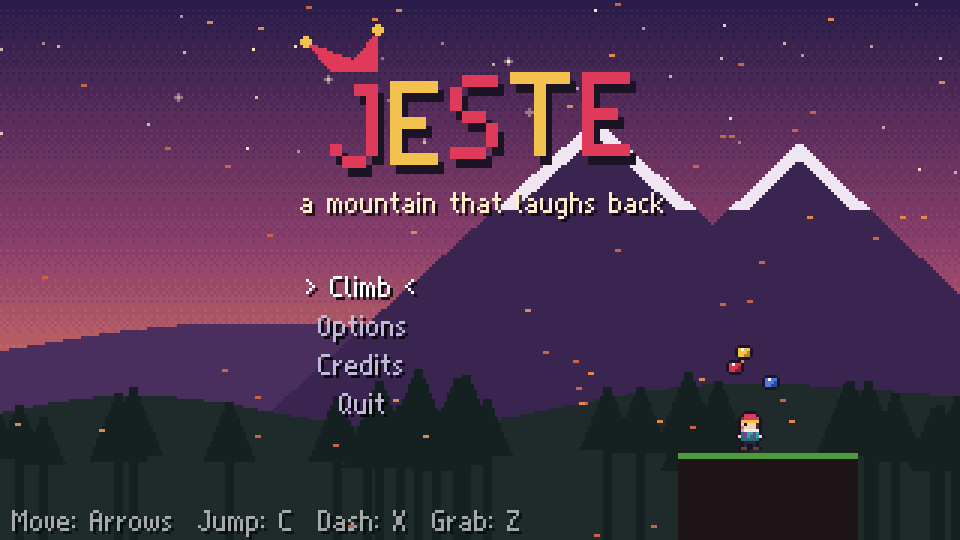

# JESTE

*A mountain that laughs back.*

A Celeste-inspired precision platformer made in **Godot 4** with hand-made pixel art.
Every room, collectible and chapter is **proven completable by an automated test-suite**
that drives the real game physics.



## The story

Mira Vale grew up as a jester in the traveling *Lark & Lantern* troupe, trained by her
grandmother **Nana Odile**, the greatest clown who ever lived. Nana always promised
they'd climb **Mount Jeste** together, the mountain whose wind is said to laugh.

Nana died last winter. Mira never cried. She kept performing and smiling until one night
on stage she froze and dropped every ball, and the crowd laughed *at* her.

So Mira goes to climb Jeste alone. The mountain, as old Bellamy the bell-ringer warns her,
is a trickster: *"It shows you whatever you hide behind your smile."*

| Chapter | Place | Mechanic | Story beat |
|---|---|---|---|
| Prologue | The Foot of Jeste | run, jump, climb, wall jump, **dash** | Mira meets Bellamy; a magpie teaches her to dash |
| 1 | Lantern Town | jack-in-the-box springs, crumbling boards, dash gems | An empty town from her childhood tour; she meets Tobi, an anxious painter |
| 2 | The Hollow Stage | velvet curtains you dash through, **chase** | A dream: her reflection steps out of a mirror. **The Grin**: the mask that never stops smiling |
| 3 | The Grand Carnival | keys & gates, comedy/tragedy mask blocks, cracked walls | Ringmaster Oddo, a ghost who never ends his show because he fears the quiet after it |
| 4 | Whistling Ridge | wind, cable gondolas | Stuck on a gondola, Mira has a panic attack; Tobi teaches her the "juggler's breath" |
| 5 | Mirror Cathedral | circus balloons, mirror panes | The Grin traps Tobi; Mira tries to destroy her and falls into the dark |
| 6 | Undertow | pinball bumpers, twin gems, chase | Bellamy reveals he climbed with Nana; Mira reconciles with the Grin, and they become one |
| 7 | The Summit | **two dashes**, every mechanic | Sunrise at the top. Mira finally cries and laughs at the same time, and the mountain laughs *with* her |
| Epilogue | The Show | - | A new act: "Three Balls and a Bell" |

The collectibles are part of the story: **61 Sunberries** (4 of them winged - collect them without dashing!), **7 Jester Bells** (Nana's
lost bells, hidden in secret rooms behind fake or cracked walls, each with a message) and a
**Golden Sunberry** in chapters 1-7 for deathless runs.

## Controls

| Action | Keyboard | Gamepad |
|---|---|---|
| Move / aim | Arrows or WASD | D-pad / left stick |
| Jump | C, Space, J | A |
| Dash | X, K, Shift | X / B |
| Grab / climb | Z, V, L | Shoulders / triggers |
| Pause | Esc, Enter, P | Start |

Pause → **Assist** offers a slower game speed, infinite stamina and invincibility.

## Running

Open the folder in Godot 4.6+ (the project was built and tested with 4.7.2) and press Play, or:

```sh
godot --path .
```

## Movement (Celeste-faithful)

The simulation in `scripts/sim/world.gd` follows Celeste's published player controller:
coyote time, jump buffering, variable jump height, half-gravity at the apex, wall slides,
wall jumps, climbing with stamina, climb-hops, 8-way dashes with end-of-dash speed,
**supers, hypers/wavedashes, wall-bounces**, dash corner correction, upward corner
correction, lift-boosts from moving platforms, and wind sheltering.

## Architecture

```
scripts/sim/      deterministic simulation (no nodes): World, RoomDef, LevelDB, Solver
scripts/game/     Level controller, renderers, effects, HUD, dialogue, save/settings, audio
scripts/ui/       title, chapter select, credits, bitmap font
data/levels/      ASCII level files, one per chapter (legend below)
data/story/       cutscene scripts
tools/            asset generators (pixel art, backgrounds, font, audio) + debug renderers
tests/            automated verification suite
```

The game, the solver and the tests all run **the same `World` code**. Rendering only
reads from it, so an input recording that clears a room in a test clears it in the game.

### Level file legend

```
#  solid ground        %  alternate solid    ,  background wall   &  fake wall (secret)
=  jump-through        ~  crumbling boards   ^ v < >  spikes
P  spawn point         S [ ]  springs (up / right / left)
*  dash gem            +  twin gem           b  sunberry          w  winged sunberry
H  jester bell         G  golden sunberry    k  key               D  locked gate
C  curtain / mirror    X  cracked wall       R B  comedy / tragedy mask blocks
Z  gondola             z  gondola target     O  balloon           o  bumper
E  chapter end         N  NPC                1-9 cutscene trigger zones
f l c t s x j a u m q r   decorations
```

Room headers set `exits` (e.g. `right:1-02 top[3-8]:1-03b`), `wind`, `dashes`, `chase`,
`npc`, `triggers`, `enter`, `title`, ...

## Animation & visual polish

- **Rigged pixel characters** (`tools/art_doll.gd`): Mira, the Grin, Bellamy, Tobi and Oddo are
  "paper dolls": hand-drawn heads and torsos plus procedurally drawn limbs, posed per frame
  from a joint table and auto-outlined. Each character has 34 frames of 24x24 animation:
  breathing idle with blinks, an 8-frame run synced to distance travelled, skid, rise/apex/fall,
  landing squash, horizontal/up/down dash poses, a 4-frame climb cycle, wall slide, duck, sit
  and talk.
- **Mira's jester cap** has two verlet-simulated tails with jingle bells. They react to
  momentum, wind and dashes, and change colour with your dashes (red / blue / pink), flashing
  white when a dash is restored.
- **Juice**: damped-spring squash & stretch, gradient dash afterimages and a ribbon trail,
  speed streaks, footstep and skid dust, wall-slide dust, landing rings, shockwaves, sparkles,
  debris, freeze frames, directional screen shake and a camera that looks ahead.
- **Lighting**: an additive glow pass with pixel-stepped falloff for Mira, gems, berries,
  bells, lanterns, torches, mushrooms and campfires, plus a per-chapter vignette.
- **Living world**: grass that sways and parts around Mira; spinning gems; springs, balloons and
  bumpers with squash and stretch; procedural cloth flags; campfire embers; crumbling boards
  that shed debris; mask blocks that flash as they swap. NPCs breathe, blink, face Mira and
  animate while they talk.
- **Cutscenes**: portraits blink and move their mouths while typing; letters pop in; angry
  lines shake; Mira faces whoever she is speaking with.
- **Painted world** (`scripts/game/terrain_art.gd`, `tools/art_bg.gd`): terrain is painted per
  pixel from the collision map (bevel, ambient occlusion, material detail, grass/snow/crystal
  caps, icicles and vines). Interior walls get pillars, beams, windows that open onto the
  backdrop, velvet curtains, bunting, crystals or ice cracks depending on the chapter.
  Parallax backdrops are painted with lit mountain faces, gullies, haze, clouds and set
  pieces such as Mount Jeste, the carnival and gothic stained glass. Bloom and per-chapter
  colour grading (`post_fx.gd`) finish the frame.
- **Set pieces**: velvet theatre curtains that ripple, mirrors that reflect Mira as she moves,
  prayer flags on the summit, procedural campfires and confetti when a chapter is cleared.

## Front end

The title screen has a beveled block-letter logo with a gloss sweep and a jester cap whose bells
jingle, plus a campfire vignette. Chapter select shows a "living postcard" for each chapter (a
parallax backdrop with the painted opening room), collectible stats, a wax seal on cleared
chapters and a trail of chapter markers. Pause, options, assist and results screens share the
same UI kit (`scripts/ui/ui_kit.gd`): framed panels, animated menu rows, sliders, toggles and
keycap prompts. Options cover music/sound volume, fullscreen, screen shake, gamepad rumble and
the speedrun timer.

## Audio

All sound is synthesized offline by `tools/gen_audio.py` on top of `tools/synth.py`, which
needs numpy:

- **Instruments**: electric piano, piano, plucks, music box, FM bells/celesta, detuned-saw
  pads and strings, a formant choir, drawbar organ, calliope, flute, a soft filtered pulse,
  bass, sub bass and tuba, plus synthesized kick, snare, brushes, hats, shaker, toms, clap and
  cymbal.
- **Mixing**: stereo panning, a convolution reverb with generated impulse responses, a
  soft-knee bus and loudness normalisation to about -16 dBFS.
- **Music**: 13 tracks built on one recurring "Jeste" theme. Gameplay tracks are 32-bar loops
  whose second half varies the instrumentation. Note tails and reverb wrap around so the
  loops are seamless. Tracks are encoded as Ogg Vorbis.
- **Ambience**: wind, crickets, cave drips, cathedral room tone, dream shimmer and carnival
  murmur loops, played under the music.
- **Sound effects**: layered and filtered, with short reverb tails. They include footsteps,
  wall-slide, climb and respawn sounds. Gamepads rumble on dashes, springs, impacts,
  collectibles and deaths.

## Automated verification

```sh
python3 tests/run_tests.py            # all chapters
python3 tests/run_tests.py --chapters 1 3 --resolve
```

1. **Task listing** (`tests/list_tasks.gd`) builds each chapter's room graph and checks
   the levels for problems such as missing spawns, spawns inside walls, or exits with no opening.
2. **Solving** (`scripts/sim/solver.gd`): a weighted-A* search over input macro-actions
   (run, jump, hold, 8-way dash, climb...) that simulates every candidate with the real
   physics. It uses a gravity-aware distance heuristic and a TSP ordering of collectibles.
   It runs in parallel Godot workers, and solutions are cached in `tests/solutions/`
   and re-verified on every run.
3. **Proof**: for every chapter, the end must be reachable from the start, and every
   collectible must be collectible on a route that can still reach the end.
4. **End-to-end**: each chapter is played through the real `Level` scene by chaining
   the proven room solutions along a shortest route that collects everything. The run
   must collect every collectible into the save data with **zero deaths**, which also
   proves every Golden Sunberry run.
5. **Menu flow** (`tests/ui_flow.tscn`): simulated input drives the title, options, chapter
   select, a level, pause, assist and options menus, return to map, results and credits.
   Each screen must be reached without script errors.

Results are written to `tests/REPORT.md`.

Useful debug tools (they need a display and use the Vulkan renderer for read-back):

```sh
godot --path . --rendering-method mobile res://tools/overview.tscn -- 3 /tmp/ch3.png       # all rooms of a chapter
godot --path . --rendering-method mobile res://tools/strip.tscn -- 3 3-03 tests/solutions/3_3-03_s0_collect.json /tmp/s.png
```

### Regenerating assets

```sh
godot --headless --path . --script res://tools/gen_art.gd   # sprites, tiles, backgrounds, font
python3 -m venv /tmp/jvenv && /tmp/jvenv/bin/pip install numpy
/tmp/jvenv/bin/python tools/gen_audio.py                     # sfx, music, ambience (needs ffmpeg)
/tmp/jvenv/bin/python tools/gen_audio.py ch3 sfx             # or just some of them
```

### Recording a gameplay video

`tools/demo.tscn` plays the title screen, a tour of the chapter select, chapter highlights
through the real game and the credits' curtain call. The gameplay is driven by the proven
routes in `tests/routes.json` (written by `run_tests.py`), and cutscenes auto-advance at
reading pace. Record it losslessly with Godot's Movie Maker
and encode with ffmpeg:

```sh
mkdir -p /tmp/jeste_movie
godot --path . --rendering-method mobile --resolution 320x180 \
      --write-movie /tmp/jeste_movie/f.png --fixed-fps 60 res://tools/demo.tscn
ffmpeg -framerate 60 -i /tmp/jeste_movie/f%08d.png -i /tmp/jeste_movie/f.wav \
       -vf "scale=1920:1080:flags=neighbor,format=yuv420p" -c:v libx264 -crf 18 \
       -tune animation -c:a aac -b:a 192k -shortest docs/jeste_gameplay.mp4
```
